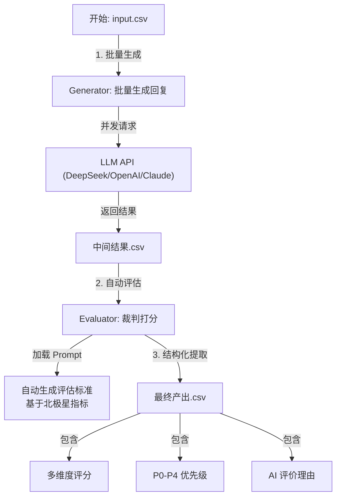

# LLM Evals Pipeline for PMs

> **拒绝"玄学"调优，让 Prompt 迭代可量化。**
> 一个专为 AI 产品经理和 Prompt 工程师设计的轻量级评估框架。支持从批量生成到多维度评分的全闭环流程。


## 💡 为什么需要这个工具？

在实际业务落地中，我们经常面临这样的痛点：
* **难以量化**：改了 Prompt，感觉变好了，但不知道具体好在哪，好多少。
* **流程繁琐**：不想用 LangSmith 那么重的工具，但 Excel 手搓又太慢。
* **维度单一**：需要同时评估"事实准确性"、"指令遵循度"和"用户吸引力"，普通脚本难以兼顾。
* **技术门槛高**：作为产品经理，不想学 Python，但需要快速验证 Prompt 效果。

**LLM Evals Pipeline** 帮你解决这些问题。它支持自定义**北极星指标 (North Star Metric)**，自动生成评估标准，并输出结构化的分析报告。

**更重要的是**：你不需要写代码！直接用 Cursor 等 AI 编程助手，用自然语言告诉它你的需求，就能完成配置和运行。

## ⚙️ 工作流架构 (Workflow)



## ✨ 核心功能

### 🎯 北极星指标驱动
输入你关注的业务指标（如"幽默感"、"极其严格的合规性"），自动生成适配的评估 Prompt。

### 📊 结构化评分
自动产出 JSON 格式评分，包含 `decision` (决策优先级)、`scores` (细分维度打分) 和 `reasoning` (评分理由)。

### 🚀 高并发处理
内置线程池，支持 tqdm 进度条，从容处理千级数据。

### 🛡️ 生产级容错
自动重试机制、错误标记、优雅的错误处理（失败行不会中断整个流程）。

### 🔌 多模型支持
无缝切换 DeepSeek、OpenAI (GPT-4o)、Anthropic (Claude 3.5)。

### 🤖 AI 助手友好（产品经理零代码）
**专为产品经理设计**：无需写代码，直接用 Cursor 等 AI 编程助手帮你配置和运行。用自然语言描述需求，AI 自动生成命令并执行。

## 🚀 快速开始

### 🌐 前端页面使用方法（Streamlit）

**推荐**：在浏览器中打开网页即可完成「配置 → 生成 Prompt → 评测 → 下载结果」全流程，无需安装或改配置文件。

#### 访问链接

**[https://llm-eval-pipeline-nyota.streamlit.app/](https://llm-eval-pipeline-nyota.streamlit.app/)**

在浏览器中打开上述链接即可使用。使用前请准备好 **DeepSeek API Key**（在侧边栏填写），以及包含 **`question`** 列的 CSV 数据（可先点击侧边栏「下载 CSV 模板」按模板准备）。

#### 网页里的使用流程

页面顶部会显示当前所在阶段：**配置 → 业务 Prompt → 评估 Prompt → 生成回答 → 评测 → 结果展示**。按顺序完成以下六步即可跑通一次评测。

| 阶段 | 页面上你会看到 | 你需要做的 |
|------|----------------|------------|
| **一、场景定义与上传** | 业务场景、北极星指标两个文本框 + 上传 CSV 区域 | 填写「业务场景」和「北极星指标」；上传 CSV（必须含 `question` 列，可选 `expected_answer`）。点「下一步：生成 Prompt」；若 CSV 里已有回答，可点「已有回答，直接生成评测方案」跳过生成。 |
| **二、业务 Prompt 确认** | 一段可编辑的「业务 Prompt」文案 | 确认或修改后，点「下一步：生成评估 Prompt」，系统会按你的场景与北极星指标生成评测用 Prompt。 |
| **三、评估 Prompt 确认** | 一段可编辑的「评估 Prompt」文案 | 确认或修改评测标准；文中须包含 `{original_text}` 与 `{model_output}`（评测时会替换为题目和回答）。点「确认并开始处理数据」进入下一阶段。 |
| **四、生成回答** | 进度与每条题目的生成状态 | 系统会按业务 Prompt 逐条调用模型生成回答。若数据里已有 `generated_answer` 或 `expected_answer`，可点「下一步：开始评测」跳过；否则等生成完成后点该按钮。 |
| **五、评测** | 进度与每条题目的评测状态 | 系统会按评估 Prompt 对「题目 + 回答」逐条打分，得到各维度小分与总分。完成后会自动跳到结果页。 |
| **六、结果展示** | 平均分、通过率、得分分布图、各维度小分表、完整结果表 | 查看指标与表格；需要留存时点击「下载完整结果 CSV」导出。结果列包含：事实性/安全性、北极星指标、完整性与连贯性、加权总分、决策、理由等，与当前评估 Prompt 输出一致。 |

#### 侧边栏说明

- **API Key**：必填，用于生成 Prompt、生成回答和评测（建议使用 [DeepSeek](https://platform.deepseek.com/) 的 Key）。
- **Model**：选择 `deepseek-chat` 或 `deepseek-reasoner`，评测阶段会使用该模型。
- **下载 CSV 模板**：下载仅含 `question` 列的模板，按模板填好数据后再上传。
- **🔄 重新开始**：清空当前会话，从阶段一重新来一遍。

#### 常见问题

- **提示“配置或数据不完整，请返回上一步”**：检查是否在阶段一填了场景和北极星、上传了含 `question` 的 CSV，并在侧边栏填了 API Key；若在阶段四报错，先点「返回评估 Prompt」回到阶段三，再点「确认并开始处理数据」重新进入。
- **提示“须包含占位符 {original_text} 与 {model_output}”**：在阶段三的评估 Prompt 里保留这两个占位符，评测时会自动替换。
- **想用自己的评测 Prompt**：在阶段三直接编辑或粘贴你的评估 Prompt，再点「确认并开始处理数据」即可。

#### 本地运行（可选）

若希望在本机运行同一套页面：

```bash
pip install -r requirements.txt
# 配置 .env 中的 DEEPSEEK_API_KEY（可选，也可在页面侧边栏填写）
streamlit run app.py
```

浏览器会打开 `http://localhost:8501`，使用流程与上述网页一致。

---

#### 传统命令行方式

### 1. 环境准备

```bash
# 克隆仓库
git clone https://github.com/Nyota-tree/llm-eval-pipeline.git
cd llm-eval-pipeline

# 安装依赖
pip install -r requirements.txt

# 配置环境变量
# Linux/Mac:
cp .env.example .env

# Windows PowerShell:
Copy-Item .env.example .env

# 或者手动创建 .env 文件，内容如下：
# DEEPSEEK_API_KEY=sk-xxxxxxxxxxxxx
# 或
# OPENAI_API_KEY=sk-xxxxxxxxxxxxx
# 或
# ANTHROPIC_API_KEY=sk-ant-xxxxxxxxxxxxx

# ⚠️ Windows 用户注意：
# 如果使用 PowerShell 创建 .env 文件，请使用以下命令确保 UTF-8 编码：
# [System.IO.File]::WriteAllText(".env", "DEEPSEEK_API_KEY=sk-xxxxxxxxxxxxx", [System.Text.Encoding]::UTF8)
# 不要使用 echo 命令，因为它可能使用错误的编码（UTF-16），导致读取失败
```

### 2. 配置参数

在 `config.py` 中调整模型和参数（已默认配置好 DeepSeek，性价比首选）。

### 3. 运行流程

**Step 1: 准备数据**  
你可以使用项目中的示例文件 `examples/input_example.csv`，或创建自己的 `input.csv` 文件。确保 CSV 文件包含 `input_text` 列。

**Step 2: 批量生成回复**

```bash
# 使用示例文件
python batch_generator.py examples/input_example.csv batch_output.csv

# 或使用你自己的文件
python batch_generator.py input.csv batch_output.csv
```
产出：`batch_output.csv`

**Step 3: 批量评估**

```bash
python batch_evaluator.py batch_output.csv batch_evaluation_results.csv
```
产出：`batch_evaluation_results.csv`

## 📖 最佳实践 (Scenarios)

作为 AI PM，你可以这样使用本工具：

### 场景 A：小红书文案风格调优

**Input**: 50 个原始标题。

**北极星指标**: "吸引力"权重 40%，"口语化"权重 30%。

**执行**: 运行 pipeline，筛选出 `attractiveness_score > 8` 的 Prompt 版本。

### 场景 B：客服话术合规性测试

**Input**: 100 个刁钻的用户投诉 Case。

**北极星指标**: "极度共情"且"绝不产生幻觉"。

**执行**: 重点查看 `factuality_score < 6` 的低分 Case，进行人工复盘。

## 🛠️ 目录结构

```
/
├── app.py               # Streamlit 前端（六阶段评测流水线，推荐使用）
├── batch_generator.py   # 生成器核心
├── batch_evaluator.py   # 评估器核心
├── generate_evaluator_prompt.py  # Prompt 生成器
├── utils.py             # 通用 LLM 客户端
├── config.py            # 配置文件 (Prompt/Model)
├── requirements.txt     # Python 依赖
├── LICENSE              # MIT 许可证
├── .env.example         # 环境变量模板
├── .gitignore          # Git 忽略文件
├── README.md           # 项目说明
└── examples/           # 示例文件目录
    ├── input_example.csv    # 示例输入文件
    └── README.md            # 示例说明
```

## 🔧 详细使用指南

### 📌 优先级系统说明 (P0-P4)

项目使用**两套独立的优先级系统**来标记内容：**生成器优先级**（输入重要性）和**评估器优先级**（输出质量）。理解这两套系统的区别对于高效使用本工具至关重要。

#### 🎯 快速参考表

**优先级含义速查**：

| 优先级 | 生成器优先级<br/>(输入重要性) | 评估器优先级<br/>(输出质量) | 典型场景示例 | 建议操作 |
|--------|:------------------------:|:------------------------:|:-----------|:--------|
| **P0** | ⭐⭐⭐⭐⭐<br/>极其重要或紧急 | ⭐⭐⭐⭐⭐<br/>最高质量，可直接发布 | 生成器：关键业务决策、VIP客户咨询<br/>评估器：加权总分≥90，各维度优秀 | 优先处理/直接发布 |
| **P1** | ⭐⭐⭐⭐<br/>重要内容 | ⭐⭐⭐⭐<br/>高质量，建议发布 | 生成器：重要客户咨询、核心功能相关<br/>评估器：加权总分80-89，质量良好 | 重点关注/通常可发布 |
| **P2** | ⭐⭐⭐<br/>常规内容 | ⭐⭐⭐<br/>中等质量，需要复核 | 生成器：普通用户请求、日常业务<br/>评估器：加权总分70-79，部分维度不足 | 标准处理/人工复核 |
| **P3** | ⭐⭐<br/>次要内容 | ⭐⭐<br/>低质量，不建议发布 | 生成器：辅助信息、非核心功能<br/>评估器：加权总分<70，存在明显问题 | 低优先级/不建议发布 |
| **P4** | ⚠️<br/>无法判定或错误<br/>（仅生成器） | ❌<br/>不使用<br/>（仅评估器） | 生成器提取失败、处理出错 | 检查错误/重新处理 |

**核心区别**：
- **生成器优先级**：根据**输入内容（原文）的重要性**判定，在生成阶段由生成器自动判定，用于指导生成器如何处理输入
- **评估器优先级**：根据**输出内容（生成结果）的质量**判定，在评估阶段由评估器重新判定，用于评估生成内容的质量
- **两者可能不同**：输入重要（P0）不代表输出质量高（可能是 P2），反之亦然
- **判定时机**：生成器优先级在生成阶段就判定了，是对原文的判定；评估器优先级在评估阶段判定，是对生成结果的判定

#### 📝 生成器优先级详解 (Generator Priority: P0-P4)

生成器在生成内容时，会根据**输入内容（原文）的重要性和复杂度**自动判定优先级。这个优先级保存在 CSV 的 `eval_priority` 列中。

**工作原理**：
1. 生成器接收 `input_text`（原文/输入内容）
2. 分析输入内容，判断其重要性和紧急程度
3. 在生成响应时，输出 `<priority>P{x}</priority>` 标签
4. 这个优先级反映的是**输入内容的重要性**，而不是生成内容的质量

**重要提示**：生成器优先级是在生成阶段就判定的，是对**原文（输入）**的优先级判定，用于指导生成器如何处理这个输入。

**优先级详细说明**：

| 优先级 | 含义 | 典型场景 | 判定标准 | 在 CSV 中的位置 |
|--------|------|----------|----------|--------------|
| **P0** | 最高优先级<br/>⭐⭐⭐⭐⭐ | • 关键业务决策<br/>• 高价值用户请求<br/>• 紧急问题处理<br/>• VIP 客户咨询<br/>• 涉及重大利益的内容 | 极其重要或紧急，需要最高质量输出 | `eval_priority` 列 |
| **P1** | 高优先级<br/>⭐⭐⭐⭐ | • 重要客户咨询<br/>• 核心功能相关<br/>• 高价值内容生成<br/>• 重要业务场景<br/>• 需要高质量处理的内容 | 重要内容，需要高质量输出 | `eval_priority` 列 |
| **P2** | 中优先级<br/>⭐⭐⭐ | • 普通用户请求<br/>• 常规内容生成<br/>• 标准流程处理<br/>• 日常业务<br/>• **最常见的情况** | 常规内容，标准质量输出（最常见） | `eval_priority` 列 |
| **P3** | 低优先级<br/>⭐⭐ | • 辅助信息<br/>• 补充内容<br/>• 非核心功能<br/>• 次要场景<br/>• 可接受较低质量的内容 | 次要内容，可接受较低质量 | `eval_priority` 列 |
| **P4** | 默认/错误<br/>⚠️ | • 无法判定优先级<br/>• 生成器提取失败<br/>• 处理出错<br/>• 输出格式不符合预期 | 兜底优先级，生成器无法提取时的默认值 | `eval_priority` 列 |

**如何查看**：在 `batch_generator.py` 的输出 CSV 中，查看 `eval_priority` 列。

**自定义判定标准**：在 `config.py` 的 `SYSTEM_PROMPT` 中定义生成器如何判定 P0-P4。例如：
```python
SYSTEM_PROMPT = """...
根据输入内容（原文）的重要性，输出优先级标签：
- P0: 极其重要或紧急的输入内容
- P1: 重要的输入内容
- P2: 常规的输入内容
- P3: 次要的输入内容

注意：这个优先级是对输入内容的判定，用于指导生成器如何处理这个输入。
..."""
```

#### ✅ 评估器优先级详解 (Evaluator Priority: P0-P3)

评估器在评估生成内容时，会根据**输出内容的质量**重新判定优先级。这个优先级保存在 CSV 的 `eval_priority` 列中（**会覆盖生成器的优先级**）。

**工作原理**：评估器会分析生成内容的质量，根据加权总分和各维度评分，在 JSON 中返回 `determined_priority` 字段。

**优先级详细说明**：

| 优先级 | 含义 | 质量特征 | 典型评分范围<br/>(0-100分制) | 对应决策 | 在 CSV 中的位置 |
|--------|------|----------|:------------------------:|----------|--------------|
| **P0** | 最高质量<br/>⭐⭐⭐⭐⭐ | • 加权总分高<br/>• 各维度评分优秀<br/>• 可直接发布<br/>• 无需人工复核 | **≥ 90 分** | 通常为 `PUBLISH` | `eval_priority` 列<br/>（覆盖生成器优先级） |
| **P1** | 高质量<br/>⭐⭐⭐⭐ | • 加权总分较高<br/>• 质量良好<br/>• 建议发布<br/>• 可能需要简单复核 | **80-89 分** | 通常为 `PUBLISH` 或 `REVIEW` | `eval_priority` 列<br/>（覆盖生成器优先级） |
| **P2** | 中等质量<br/>⭐⭐⭐ | • 加权总分中等<br/>• 部分维度可能不足<br/>• 需要复核<br/>• 可能需要修改 | **70-79 分** | 通常为 `REVIEW` | `eval_priority` 列<br/>（覆盖生成器优先级） |
| **P3** | 低质量<br/>⭐⭐ | • 加权总分较低<br/>• 存在明显问题<br/>• 不建议发布<br/>• 需要大幅修改或重做 | **< 70 分** | 通常为 `REVIEW` 或 `REJECT` | `eval_priority` 列<br/>（覆盖生成器优先级） |

**重要提示**：
- ⚠️ 评估器**不包含 P4**，如果无法判定默认为 P3
- ⚠️ 评估器的优先级会**覆盖**生成器的优先级（因为评估器优先级反映的是实际输出质量）
- ✅ 评估器优先级基于客观的评分标准，比生成器优先级更可靠

**如何查看**：在 `batch_evaluator.py` 的输出 CSV 中，查看 `eval_priority` 列（这是评估器重新判定的优先级）。

**自定义判定标准**：在 `config.py` 的 `EVALUATION_PROMPT` 中定义评估器如何判定 P0-P3。例如：
```python
EVALUATION_PROMPT = """...
根据加权总分判定优先级：
- P0: weighted_total_score ≥ 90（最高质量）
- P1: 80 ≤ weighted_total_score < 90（高质量）
- P2: 70 ≤ weighted_total_score < 80（中等质量）
- P3: weighted_total_score < 70（低质量）
..."""
```

#### 🔗 优先级与决策的关系

**优先级（Priority）** 和 **决策（Decision）** 是两个独立的维度，但通常有对应关系：

**核心概念**：
- **优先级（P0-P3）**：由 LLM 根据业务逻辑或质量评分判定，反映内容的重要性或质量等级
- **决策（PUBLISH/REVIEW/REJECT）**：由代码根据客观评分阈值自动判定，提供明确的发布建议

**对应关系表**：

| 评估器优先级 | 典型决策 | 判定条件（代码自动判定） | 说明 | 建议操作 |
|------------|---------|:---------------------:|------|:--------|
| **P0**<br/>⭐⭐⭐⭐⭐ | `PUBLISH` | • `weighted_total_score ≥ 75`<br/>• `factuality_score ≥ 5` | 最高质量，可直接发布 | ✅ 直接发布，无需复核 |
| **P1**<br/>⭐⭐⭐⭐ | `PUBLISH` 或 `REVIEW` | • `weighted_total_score ≥ 75`<br/>• `factuality_score ≥ 5` | 高质量，通常可发布 | ✅ 通常可发布，简单复核即可 |
| **P2**<br/>⭐⭐⭐ | `REVIEW` | • `60 ≤ weighted_total_score < 75`<br/>• `factuality_score ≥ 5` | 中等质量，需要人工复核 | ⚠️ 需要人工复核，可能需要修改 |
| **P3**<br/>⭐⭐ | `REVIEW` 或 `REJECT` | • `weighted_total_score < 60`<br/>• 或 `factuality_score < 5` | 低质量，不建议发布 | ❌ 不建议发布，需要大幅修改或重做 |
| **P4**<br/>（仅生成器） | `ERROR` | 生成器无法提取优先级 | 处理出错或无法判定 | 🔧 检查错误，重新处理 |

**决策判定逻辑**（由代码自动判定，基于客观评分阈值）：

1. **REJECT（拒绝）**：
   - 条件：`factuality_score < 5`（存在幻觉或事实错误）
   - 说明：无论其他分数如何，只要事实性分数低于 5 分，直接拒绝
   - 优先级：通常对应 P3

2. **PUBLISH（发布）**：
   - 条件：`weighted_total_score >= 75` 且 `factuality_score >= 5`
   - 说明：质量达到发布标准，可直接发布
   - 优先级：通常对应 P0 或 P1

3. **REVIEW（复核）**：
   - 条件：其他所有情况
   - 说明：需要人工复核，可能需要修改
   - 优先级：通常对应 P2 或 P3

**重要提示**：
- ✅ **优先级**：由 LLM 根据业务逻辑或质量评分判定，可以在 `SYSTEM_PROMPT` 和 `EVALUATION_PROMPT` 中自定义判定标准
- ✅ **决策**：由代码根据评分自动判定，基于客观的评分阈值（不可自定义，除非修改代码）
- 📊 **优先级的作用**：帮助你快速筛选需要重点关注的内容（如 P0 内容需要优先处理）
- 🎯 **决策的作用**：提供明确的发布建议（PUBLISH/REVIEW/REJECT），基于客观标准
- ⚠️ **两者可能不一致**：优先级是主观判定，决策是客观判定，两者可能不完全对应

#### 💡 如何使用优先级

**1. 筛选高质量内容**：
```python
# 在 Excel 或 Python 中筛选
import pandas as pd
df = pd.read_csv('evaluated.csv')

# 筛选最高质量内容（P0）
df[df['eval_priority'] == 'P0']

# 筛选高质量内容（P0 和 P1）
df[df['eval_priority'].isin(['P0', 'P1'])]

# 筛选需要复核的内容（P2 和 P3）
df[df['eval_priority'].isin(['P2', 'P3'])]
```

**2. 结合决策筛选**：
```python
# 筛选可直接发布的高质量内容
df[(df['eval_priority'] == 'P0') & (df['decision'] == 'PUBLISH')]

# 筛选需要复核的高质量内容
df[(df['eval_priority'].isin(['P0', 'P1'])) & (df['decision'] == 'REVIEW')]

# 筛选被拒绝的内容
df[df['decision'] == 'REJECT']
```

**3. 优先级分布分析**：
- 📊 查看评估结果统计中的"优先级分布"，了解内容质量分布情况
- ✅ **P0/P1 占比高**：说明整体质量好，生成策略有效
- ⚠️ **P3 占比高**：说明需要优化生成策略，检查 Prompt 或模型参数
- 📈 **P2 占比高**：说明质量中等，可以考虑微调提升到 P1

**4. 实际应用场景**：
- 🎯 **内容发布流程**：优先处理 P0/P1 且决策为 PUBLISH 的内容
- 🔍 **质量监控**：定期查看 P3 占比，评估生成质量趋势
- 📝 **Prompt 优化**：分析 P2/P3 内容的共同问题，针对性优化 Prompt
- ⚡ **资源分配**：将更多资源投入到 P0 内容的生成和复核

#### 自定义优先级判定标准

你可以在 `config.py` 中自定义优先级判定标准：

- **生成器优先级**：在 `SYSTEM_PROMPT` 中定义生成器如何判定 P0-P4
- **评估器优先级**：在 `EVALUATION_PROMPT` 中定义评估器如何判定 P0-P3

例如，你可以让评估器根据加权总分判定优先级：
- P0: weighted_total_score ≥ 90
- P1: 80 ≤ weighted_total_score < 90
- P2: 70 ≤ weighted_total_score < 80
- P3: weighted_total_score < 70

### Script 1: 批量生成器 (batch_generator.py)

从原始 CSV 文件生成模型响应。

**用法:**
```bash
python batch_generator.py <输入CSV文件> <输出CSV文件>
```

**输入 CSV 要求:**
- 必须包含 `config.INPUT_COLUMN` 指定的列（默认为 `input_text`）
- 每行包含一条需要处理的原始数据

**输出 CSV:**
- 包含原始数据的所有列
- 新增 `model_response` 列：LLM 的完整响应（包含思考过程）
- 新增 `eval_priority` 列：**生成器判定的优先级**（P0-P4，如果输出包含 `<priority>` 标签）
  - 这是生成器根据输入内容自动判定的优先级
  - 如果无法提取，默认为 P4
- 新增 `final_content` 列：提取的最终内容（如果输出包含 `<content>` 标签）

### Script 2: 批量评估器 (batch_evaluator.py)

对模型响应进行评估，并将 JSON 结果展平为单独的列。

**用法:**
```bash
python batch_evaluator.py <输入CSV文件> <输出CSV文件>
```

**输入 CSV 要求:**
- 必须包含 `config.INPUT_TEXT_COLUMN` 指定的列（默认为 `input_text`）
- 必须包含 `config.FINAL_CONTENT_COLUMN` 指定的列（默认为 `final_content`）

**输出 CSV:**
- 包含原始数据的所有列
- 新增评估列：
  - `eval_priority`: **评估器重新判定的优先级**（P0-P3）
    - 这是评估器根据内容质量重新判定的优先级，与生成器的优先级可能不同
    - 评估器不包含 P4，如果无法判定默认为 P3
    - 详见上方"优先级系统说明"章节
  - `factuality_score`: 事实性评分 (0-10)
  - `completeness_score`: 全面性评分 (0-10)
  - `adherence_score`: 指令遵循度评分 (0-10)
  - `attractiveness_score`: 吸引力评分 (0-10)
  - `weighted_total_score`: 加权总分 (0-100)
  - `decision`: 决策 (PUBLISH/REJECT/REVIEW/ERROR)
    - PUBLISH: 高质量，加权总分 ≥ 75，可直接发布
    - REVIEW: 中等质量，加权总分 < 75，需要人工复核
    - REJECT: 低质量，事实性分数 < 5，存在幻觉，直接拒绝
    - ERROR: 处理出错
  - `reason`: 决策原因
  - `reasoning`: 评估理由（AI 评估器的详细评价）
  - `pass`: 是否通过（布尔值）

### Script 3: 评估员 Prompt 生成器 (generate_evaluator_prompt.py)

根据应用场景和北极星指标，自动生成专业的评估员 Prompt。

**用法:**
```bash
python generate_evaluator_prompt.py <应用场景> <北极星指标> [输出文件]
```

**参数说明:**
- `<应用场景>`: 被评估内容的场景描述（例如：小红书文案、Python代码、客服回复）
- `<北极星指标>`: 用户最看重的核心价值（例如：幽默感、代码安全性、极度共情）
- `[输出文件]`: 可选，生成的 Prompt 保存路径（默认: `generated_evaluator_prompt.txt`）

**示例:**
```bash
# Linux/Mac - 生成小红书文案评估 Prompt
python generate_evaluator_prompt.py "小红书文案生成" "幽默感和传播力"

# Linux/Mac - 生成代码审查评估 Prompt
python generate_evaluator_prompt.py "Python代码审查" "代码安全性和可维护性" code_review_prompt.txt

# ⚠️ Windows PowerShell 用户注意：
# 如果参数包含中文，可能会遇到编码问题。建议使用以下方法：
# 方法1：使用引号包裹参数（推荐）
python generate_evaluator_prompt.py "小红书文案生成" "幽默感和传播力"

# 方法2：如果方法1失败，创建一个临时 Python 脚本
# 创建 run_generate.py 文件：
# import sys
# sys.argv = ['generate_evaluator_prompt.py', '小红书文案生成', '幽默感和传播力']
# exec(open('generate_evaluator_prompt.py').read())
# 然后运行：python run_generate.py
```

**功能特点:**
- 自动生成符合规范的评估员 Prompt
- 包含完整的评分标准（Factuality/Safety、North Star Metric、Completeness）
- 自动计算权重分配（总和为 100%）
- 生成标准的 JSON 输出格式
- **可选择自动更新到 `config.py`**：运行后会询问是否更新，输入 `y` 即可自动替换 `EVALUATION_PROMPT`

**生成的 Prompt 如何使用:**
1. **方式 1（推荐）**：运行脚本时选择 `y`，自动更新到 `config.py` 的 `EVALUATION_PROMPT`
2. **方式 2**：手动复制生成的 Prompt，粘贴到 `config.py` 的 `EVALUATION_PROMPT = """..."""` 中
3. **方式 3**：直接使用生成的 `.txt` 文件作为参考，手动编辑 `config.py`

## ⚙️ 配置说明

所有配置都在 `config.py` 文件中，包括：

### Prompt 配置说明

**生成器 Prompt (`SYSTEM_PROMPT`)**：
- **位置**：`config.py` 中的 `SYSTEM_PROMPT` 变量
- **用途**：控制生成器如何生成内容和判定优先级
- **配置方式**：**手动编辑 `config.py`**，或让 Cursor 帮你修改
- **输出格式要求**：如果使用优先级功能，必须包含 `<priority>P{x}</priority>` 和 `<content>...</content>` 标签

**评估器 Prompt (`EVALUATION_PROMPT`)**：
- **位置**：`config.py` 中的 `EVALUATION_PROMPT` 变量
- **用途**：控制评估器如何评估生成的内容和重新判定优先级
- **配置方式**：
  1. **自动生成（推荐）**：使用 `generate_evaluator_prompt.py` 生成，运行后选择 `y` 自动更新到 `config.py`
  2. **手动编辑**：直接编辑 `config.py` 中的 `EVALUATION_PROMPT`
- **输出格式要求**：必须返回 JSON 格式，包含 `determined_priority`、`scores`、`weighted_total_score`、`reasoning`、`pass` 等字段

### API 配置

```python
# 选择 API 提供商
API_PROVIDER = "deepseek"  # 或 "openai"、"anthropic"

# 模型配置
DEEPSEEK_MODEL = "deepseek-chat"
DEEPSEEK_TEMPERATURE = 0.7
DEEPSEEK_MAX_TOKENS = 4000
```

### 批处理配置

```python
MAX_WORKERS = 5        # 并发线程数，建议 3-10，根据 API 限制调整
MAX_RETRIES = 3        # API 调用失败时的重试次数
RETRY_DELAY = 1        # 重试延迟（秒）
```

### 提示词配置

#### 生成器提示词

```python
SYSTEM_PROMPT = """You are a helpful AI assistant.
...your custom instructions...
"""

USER_PROMPT_TEMPLATE = "{input_text}"  # 支持 {input_text} 占位符
```

#### 评估器提示词

```python
EVALUATION_PROMPT = """Evaluate the following content...
Original Input: {original_text}
Model Output: {model_output}
...your evaluation criteria...
"""
```

**重要**：评估提示词必须要求返回 JSON 格式，且 JSON 结构要明确！

### 列名配置

```python
INPUT_COLUMN = "input_text"              # 输入 CSV 的列名
OUTPUT_COLUMN = "model_response"         # 输出列名（生成器）
FINAL_CONTENT_COLUMN = "final_content"   # 最终内容列名
INPUT_TEXT_COLUMN = "input_text"         # 评估器读取的原始输入列名
```

## 🎨 自定义提示词

### 修改生成提示词

编辑 `config.py`:

```python
# 系统提示词
SYSTEM_PROMPT = """You are a professional translator.
Your task is to translate the given text accurately and naturally.
"""

# 用户提示词模板
USER_PROMPT_TEMPLATE = "Translate this to English: {input_text}"
```

### 修改评估提示词

编辑 `config.py` 中的 `EVALUATION_PROMPT`:

```python
EVALUATION_PROMPT = """Evaluate the text based on:
- Clarity (1-10): How clear and understandable is the text?
- Accuracy (1-10): How accurate and correct is the information?
- Fluency (1-10): How natural and fluent is the language?

Original Input: {original_text}
Model Output: {model_output}

Return ONLY JSON:
{{
    "determined_priority": "P0/P1/P2/P3",
    "scores": {{
        "factuality_score": <0-10>,
        "completeness_score": <0-10>,
        "adherence_score": <0-10>,
        "attractiveness_score": <0-10>
    }},
    "weighted_total_score": <calculated_total_0_to_100>,
    "reasoning": "<explanation>",
    "pass": <true/false>
}}

Note: 
- Each dimension score is 0-10 points
- weighted_total_score = (factuality_score * 3) + (completeness_score * 2) + (adherence_score * 2.5) + (attractiveness_score * 2.5)
- weighted_total_score ranges from 0 to 100 (since weights sum to 10)
- Decision threshold: weighted_total_score >= 75 for PUBLISH
```

**重要说明**：
- 评估器支持两种 JSON 格式：
  1. **扁平格式**（推荐）：`{"scores": {"factuality_score": 9, "completeness_score": 9}}`
  2. **嵌套格式**：`{"scores": {"factuality_safety": {"score": 9, "weight": 0.35}}}`
- 评分标准：各维度分数为 0-10 分制，加权总分为 0-100 分制
- 决策逻辑：加权总分 >= 75 分发布，< 75 分人工复核，事实性分数 < 5 分直接拒绝

## 🔍 结果提取功能

生成器支持从 LLM 输出中自动提取结构化结果：

- **优先级提取**: 自动提取 `<priority>P0</priority>` 等标签
- **内容提取**: 自动提取 `<content>...</content>` 标签中的内容
- **清理功能**: 自动清理内容中的杂质标签（如 `<Title>`, `<Brief>` 等）

如果输出不包含这些标签，会使用兜底逻辑：移除 `<thinking>` 标签后返回剩余内容。

## ⚡ 性能优化

- **并发处理**: 默认使用 5 个线程，可在 `config.py` 中调整 `MAX_WORKERS`
- **错误处理**: API 调用失败会自动标记为错误，不会中断整个流程
- **进度显示**: 实时显示处理进度和预计剩余时间
- **编码自动检测**: 自动尝试多种编码格式读取 CSV 文件

## 🌐 支持的 API 提供商

### OpenAI
- 模型: gpt-4, gpt-4-turbo, gpt-4o-mini, gpt-3.5-turbo 等
- 环境变量: `OPENAI_API_KEY`
- 获取密钥: https://platform.openai.com/api-keys

### Anthropic
- 模型: claude-3-5-sonnet, claude-3-opus, claude-3-haiku 等
- 环境变量: `ANTHROPIC_API_KEY`
- 获取密钥: https://console.anthropic.com/

### DeepSeek
- 模型: deepseek-chat, deepseek-reasoner 等
- 环境变量: `DEEPSEEK_API_KEY`
- 获取密钥: https://platform.deepseek.com/
- 使用 OpenAI 兼容的 API

## ⚠️ 注意事项

1. **API 密钥安全**: 不要将 `.env` 文件提交到版本控制系统
2. **API 限制**: 注意 API 的速率限制，适当调整 `MAX_WORKERS`
3. **CSV 编码**: 输出文件使用 UTF-8-BOM 编码，确保中文正确显示
4. **JSON 解析**: 评估器会自动从响应中提取 JSON，支持多种格式（纯 JSON、代码块中的 JSON 等）
5. **提示词设计**: 确保评估提示词明确要求返回 JSON 格式，并指定 JSON 结构
6. **Windows 环境兼容性**:
   - 创建 `.env` 文件时，请使用 PowerShell 的 `[System.IO.File]::WriteAllText()` 方法，或使用文本编辑器（如 VS Code）创建，确保使用 UTF-8 编码
   - 如果命令行参数包含中文，建议使用引号包裹，或创建临时 Python 脚本传递参数
   - CSV 文件会自动尝试多种编码格式读取，通常不会有问题

## 🔧 故障排除

### 常见错误

1. **找不到 API 密钥**
   - 检查 `.env` 文件是否存在且包含正确的密钥
   - 确认密钥名称与 `config.py` 中的 API_PROVIDER 匹配

2. **CSV 列不存在**
   - 检查输入 CSV 是否包含必需的列
   - 确认 `config.py` 中的列名配置正确

3. **JSON 解析失败**
   - 检查评估提示词是否明确要求返回 JSON
   - 查看错误详情中的原始响应
   - 确保 JSON 格式正确

4. **API 调用失败**
   - 检查 API 密钥是否正确
   - 检查 API 账户余额
   - 降低 `MAX_WORKERS` 值（可能触发速率限制）
   - 检查网络连接

## 📄 许可证

MIT License

## About

Developed by **nyota佳树** (AI Product Manager / INTJ). 致力于探索 AI Native 产品的落地与评估方法论。

- 公众号：Nyota佳树
- 小红书：Nyota佳树
- X：Nyota佳树

## 🤝 贡献

欢迎提交 Issue 和 Pull Request！

---

**祝你使用愉快！** 🎉
